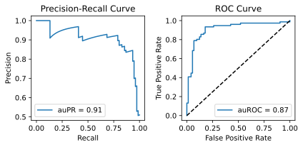
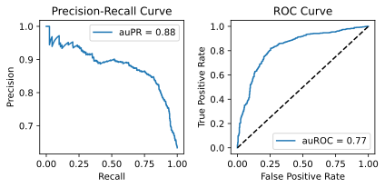
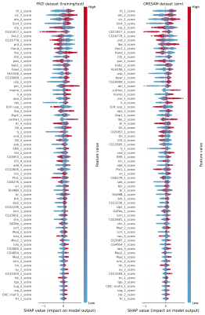

# Predicting Temperature-Sensitive Expression of Polycomb Group-Regulated Genes Using Machine Learning and Identifying Underlying Transcription Factors via Shapley Analysis

Polycomb group (PcG) proteins, evolutionarily conserved across higher eukaryotes, epigenetically silence hundreds of genes crucial in development, differentiation, and various biological processes like cell cycle control, metabolism, and tissue homeostasis1-4. Their dysregulation can lead to diseases, most notably cancer, highlighting their significance in maintaining cellular integrity3,4.

In *Drosophila*, in which the PcG machinery was first discovered, PcG proteins that act in multi-protein complexes are recruited to their target regions by *cis*-regulatory DNA elements known as Polycomb response elements (PREs). These PREs act as nucleation sites for PcG complexes to establish large repressive Polycomb domains. Consisting of various binding sites for proteins thought to be involved in PcG recruitment, PREs regulate their target genes in conjunction with other regulatory DNA sequences (e.g., enhancers) in a cell- or tissue-specific manner1-4. Insulator proteins, which play a role in demarcating chromatin and organizing genomic architecture, appear to act closely with PcG in regulating PcG target gene expression and ensuring PcG-mediated repression5-8. PcG proteins modulate chromatin structure at multiple scales to suppress transcription in their domains and separate it from transcriptionally active chromatin domains9.

In *Drosophila*, PcG-regulated genes display a distinct temperature sensitivity, where transcription increases at lower temperatures, and the majority of PcG target genes exhibit this characteristic sensitivity10-13. Flies adapted to various climates, particularly those from temperate regions with a broad temperature range, however, tend to exhibit less of the typical PcG-mediated temperature-sensitive expression.14-17

The aim of this project is to identify factors contributing to the characteristic temperature sensitivity of PcG-regulated gene expression. To achieve this, a model was trained to predict temperature-sensitive expression of PcG-regulated genes. We focused on tree-based models for model selection (Random Forests and XGBoost), as they have gained popularity in genetics and genomics. Their strength lies in handling complex, high-dimensional data and modeling the nonlinear relationships inherent in genetic information. The model training utilized a dataset comprising fly lines from two distinct populations: temperate France (FR) and tropical Zambia (ZI), both of which have whole-genome expression and sequence data available17. Expression of PcG target genes in the French population shows less temperature sensitivity compared to the Zambian population17, providing an opportunity to model not only between-gene differences but also within-gene variations. 

From a feature set comprising motif scores of transcription factor binding sites (TFBS) within PcG target gene regions to model *cis*-acting effects, and genome-wide fold changes in gene expression between lower and higher rearing temperatures to account for *trans*-acting effects, a subset of features enhancing model performance was selected. A binary classification approach was selected, with the target variable assigned a class value of '1' for significant overexpression at the lower rearing temperature relative to the higher temperature, and '0' for the absence of such overexpression. 

Model and feature selection led to an optimized XGBoost model trained on a subset of 70 features (see Notebook A), consisting exclusively of TFBS motif scores. Model performance was evaluated on an unseen testset, split from the dataset prior to training (Figure 1). We assessed performance using auPR (Area Under the Precision-Recall Curve) and auROC (Area Under the Receiver Operating Characteristic Curve), while auPR highlights the model's accuracy in identifying positive cases, auROC gauges its overall ability to distinguish between classes.

*Figure 1. Model performance on testset.*

To further assess the model's performance, it was evaluated against a second independent dataset ('aimset'), highly similar to the training set. This dataset included gene expression and sequence data for female flies from two inbred lines, Oregon-R (ORE) and Samarkand (SAM), reared at 13°C and 29°C18,19. Despite a slight decline in predicting the negative class, the model overall exhibits strong performance on both datasets (Figure 2), indicating its effectiveness in handling different biological contexts. (see Notebook B)

*Figure 2. Model performance on aimset.*

The relatively high number of features suggests that many transcription factors contribute to PcG-typical temperature-sensitive expression in a more gene-specific manner. This set of best-performing features also includes two PcG recruiter proteins encoded by the genes *Dsp1* and *Trl*, as well as the insulator protein Su(Hw). 

To assess the specific impact of features on model predictions, a feature importance analysis, including SHAP analysis, was performed. Unlike the inherent feature importance of tree-based models, SHAP analysis offers the additional advantage of being applicable across various datasets, not confined to the training set. Moreover, it enables the assessment of whether a feature's influence on the prediction is positive or negative. 

Most of the features exhibit predictive power for only a small subset of genes, as reflected in their relatively low coverage values (i.e., the number of predictions a feature affects), highlighting the more gene-specific nature of PcG-typical temperature sensitivity. The highest-ranking SHAP values in both datasets (FR/ZI and ORE/SAM) were observed for motifs of the transcription factors encoded by *tll*, *cic*, and *ato*. High DNA-binding affinity scores for these motifs were predictive for PcG-typical overexpression (i.e., the positive class/'1') (Figure 3). Notably, the TFBS motif bound by the transcription factor encoded by *bab1*, known to be involved in thermal transcriptional plasticity, is also among the top-ranking features20. High DNA-binding affinity scores associated with this motif also predict the positive class (Figure 3). (see Notebook C)

*Figure 3. SHAP feature importances (ranked from top to bottom) and directionality of each feature's impact on model prediction for both the FR/ZI and the ORE/SAM dataset.*

The scripts included in this project enable both training and making predictions, starting directly from short read sequence data:

- wgs_trim_map_snps_cns.sh: Whole Genome Sequencing Pipeline
- merge_fastq.sh: Merge FASTQ Files
- rnaseq_map_count.sh: RNA Sequencing Mapping and Counting
- get_fasta_per_gene.sh: Extract and Align FASTA Sequences by Gene
- get_raw_motif_scores_pwmenrich.R: Motif Analysis for Sequence Groups
- get_expr_edger.R: Gene Expression Analysis with edgeR
- get_features.py: Build Feature Dataframe
- train.py: Train and Evaluate Machine Learning Models
- predict.py: Generate Predictions and Evaluate Model

(Further details can be found in the Script Documentation README in the script folder and also in Notebook B.)

###### *References:*
<ol style="font-size: smaller;">
  <li><i>Kuroda, Mitzi I., et al. "Dynamic competition of polycomb and trithorax in transcriptional programming." Annual review of biochemistry 89 (2020): 235-253.</i></li>
  <li><i>Giner-Laguarda, Natalia, and Miguel Vidal. "Functions of polycomb proteins on active targets." Epigenomes 4.3 (2020): 17.</i></li>
  <li><i>Parreno, Victoria, Anne-Marie Martinez, and Giacomo Cavalli. "Mechanisms of Polycomb group protein function in cancer." Cell Research 32.3 (2022).</i></li>
  <li><i>Chetverina, D. A., D. V. Lomaev, and M. M. Erokhin. "Polycomb and trithorax group proteins: the long road from mutations in Drosophila to use in medicine." Acta Naturae 12.4 (47) (2020): 66-85.</i></li>
  <li><i>Heurteau, Alexandre, et al. "Insulator-based loops mediate the spreading of H3K27me3 over distant micro-domains repressing euchromatin genes." Genome Biology 21 (2020): 1-19.</i></li>
  <li><i>Erokhin, Maksim, et al. "Boundaries potentiate polycomb response element-mediated silencing." BMC biology 19.1 (2021): 113.</i></li>
  <li><i>Chetverina, Darya, et al. "Comparative interactome analysis of the PRE DNA-binding factors: purification of the Combgap-, Zeste-, Psq-, and Adf1-associated proteins." Cellular and Molecular Life Sciences 79.7 (2022): 353.</i></li>
  <li><i>Chetverina, D. A., et al. "Recruitment to chromatin of (GA) n-associated factors GAF and Psq in the transgenic model system depends on the presence of architectural protein binding sites." Doklady Biochemistry and Biophysics. Vol. 506. No. 1. Moscow: Pleiades Publishing, 2022.</i></li>
  <li><i>Uckelmann, Michael, and Chen Davidovich. "Chromatin compaction by Polycomb group proteins revisited." Current Opinion in Structural Biology 86 (2024): 102806.</i></li>
  <li><i>Fauvarque, Marie-Odile, and Jean-Maurice Dura. "polyhomeotic regulatory sequences induce developmental regulator-dependent variegation and targeted P-element insertions in Drosophila." Genes & development 7.8 (1993): 1508-1520.</i></li>
  <li><i>Chan, C. S., Lv Rastelli, and V. Pirrotta. "A Polycomb response element in the Ubx gene that determines an epigenetically inherited state of repression." The EMBO journal 13.11 (1994): 2553-2564.</i></li>
  <li><i>Zink, Daniele, and Renato Paro. "Drosophila Polycomb‐group regulated chromatin inhibits the accessibility of a trans‐activator to its target DNA." The EMBO journal 14.22 (1995): 5660-5671.</i></li>
  <li><i>Bantignies, Frédéric, et al. "Inheritance of Polycomb-dependent chromosomal interactions in Drosophila." Genes & development 17.19 (2003): 2406-2420.</i></li>
  <li><i>Voigt, Susanne, et al. "Positive selection at the polyhomeotic locus led to decreased thermosensitivity of gene expression in temperate Drosophila melanogaster." Genetics 200.2 (2015): 591-599.</i></li>
  <li><i>Voigt, Susanne, Anna Christina Erpf, and Wolfgang Stephan. "Decreased temperature sensitivity of vestigial gene expression in temperate populations of Drosophila melanogaster." Genes 10.7 (2019): 498.</i></li>
  <li><i>Voigt, Susanne, and Luise Kost. "Differences in temperature-sensitive expression of PcG-regulated genes among natural populations of Drosophila melanogaster." G3 11.9 (2021): jkab237.</i></li>
  <li><i>Voigt, Susanne, and Christin Froschauer. "Genome-wide temperature-sensitivity of Polycomb group regulation and reduction thereof in temperate Drosophila melanogaster." Genetics 224.2 (2023): iyad075.</i></li>
  <li><i>Chen, Jun, Viola Nolte, and Christian Schlötterer. "Temperature stress mediates decanalization and dominance of gene expression in Drosophila melanogaster." PLoS genetics 11.2 (2015): e1004883.</i></li>
  <li><i>Burny, Claire, et al. "Highly parallel genomic selection response in replicated Drosophila melanogaster populations with reduced genetic variation." Genome Biology and Evolution 13.11 (2021): evab239.</i></li>
  <li><i>De Castro, Sandra, et al. "bric à brac (bab), a central player in the gene regulatory network that mediates thermal plasticity of pigmentation in Drosophila melanogaster." PLoS genetics 14.8 (2018): e1007573.</i></li>
</ol>

